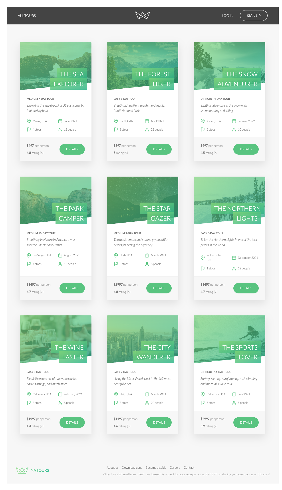

<h1 align="center"> Natours </h1>

<p align="center">
  <a href="#-project">Project</a>&nbsp;&nbsp;&nbsp;|&nbsp;&nbsp;&nbsp;
  <a href="#-running">Running</a>&nbsp;&nbsp;&nbsp;|&nbsp;&nbsp;&nbsp;
  <a href="#memo-license">License</a>
</p>

<br>

## 💻 Project

Natours is an app that provides a list of tours that can be booked and paid for. It has the following features:

- Authentication by login
- Autorization according to user roles (or even a guest access)
- REST API
- Tour: CRUD, booking, review, rating, ploting on a map
- User profile with including email, password, photo, and possibility to update most of them
- Credit card payment via Stripe
- Whatsapp redirection
- Counter for how many users reached teachers by whatsapp





### Tech Stack

- [Node.js](https://nodejs.org/en/)
- [Express](https://expressjs.com/pt-br/)
- [MongoDB](https://www.mongodb.com/)
- [JavaScript](https://www.javascript.com/)
- [Pug Templates](https://pugjs.org/api/getting-started.html)
- [JWT](https://jwt.io/)
- [Parcel](https://parceljs.org/)
- [Mapbox](https://www.mapbox.com/)
- [Stripe](https://stripe.com/en-br)
- [Mailtrap](https://mailtrap.io/)
- [Sendgrid](https://sendgrid.com/)
- [Heroku](https://www.heroku.com/)

## 🚀 Running

1. Create a `dev.env` file in `src/config` folder with the environment variables used in `env.js` file in the same folder.

2. On the root folder install the dependencies
```sh
  $ npm install
```

2. Build js bundle
```sh
  $ npm run build:js
```

3. Run
```sh
  $ npm run start
```

Some other running scripts can be chosen (such as building the js bundle interactively, in watch mode) in `package.json`.


## :memo: License

From Udemy course Node.js, Express, MongoDB & More: The Complete Bootcamp
